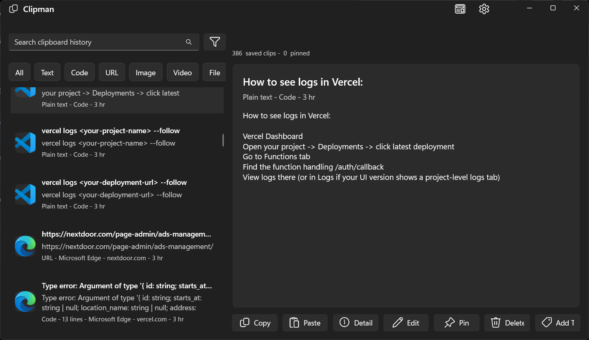

# Clipman

Clipman is a modern Windows clipboard manager built with WinUI 3.

It runs in the background, stores clipboard history locally, and lets you quickly search, pin, and paste previous clips.

## Features

- Persistent local clipboard history (text, code, URLs, images, files, HTML, and more).
- Fast search with type filters and pinned-first ordering.
- Global and local hotkeys (customizable in Settings).
- Tray icon with quick show/hide, recent clips, and one-click paste.
- Source context capture for clips (app/window and browser URL when available).
- Local ESENT database storage.

## Important Hotkeys (Defaults)

These are the default bindings. You can change all of them in `Settings`.

| Action | Default | Scope |
|---|---|---|
| Open/Toggle Clipman window | `Ctrl+Shift+V` | Global |
| Paste selected clip | `Enter` | Local (when Clipman is focused) |
| Toggle pin on selected clip | `Ctrl+P` | Local |
| Show/Hide details panel | `Ctrl+E` | Local |
| Paste recent slot 1-9 | `Alt+1` ... `Alt+9` | Local |
| Close Clipman window | `Esc` | Local |
| Move selection | `Up` / `Down` | Local |
| Page jump in list | `PageUp` / `PageDown` | Local |

## Quick Start

1. Open `Clipman.csproj` in Visual Studio.
2. Build and run (`F5`).
3. Copy anything normally in Windows.
4. Press `Ctrl+Shift+V` to open Clipman.
5. Search/select a clip and press `Enter` to paste.

## Search Tips

- Free text search matches title, preview, clip content, file path, app, window title, URL/domain, and tags.
- Type filters are available in the UI.
- Token search is supported:
  - `url:github.com`
  - `app:chrome`
  - `tag:work`

## Tray Workflow

- Left-click tray icon: show/hide window.
- Right-click tray icon: quick menu with recent clips and `Exit`.
- Selecting a clip from the tray menu pastes it into the previously focused app.

## Settings

From the top-right Settings button, you can:

- Rebind hotkeys and choose Global vs Local for each action.
- Enable/disable file search indexing mode.
- Enable startup on Windows boot.
- Show/hide the details panel by default.

## Data And Config Locations

- Settings file:
  - `%LocalAppData%\\Clipman\\settings.json`
- History database (ESENT):
  - `%LocalAppData%\\Clipman\\Esent\\history.edb`

## Requirements

- Windows 10 (1809+) or Windows 11.
